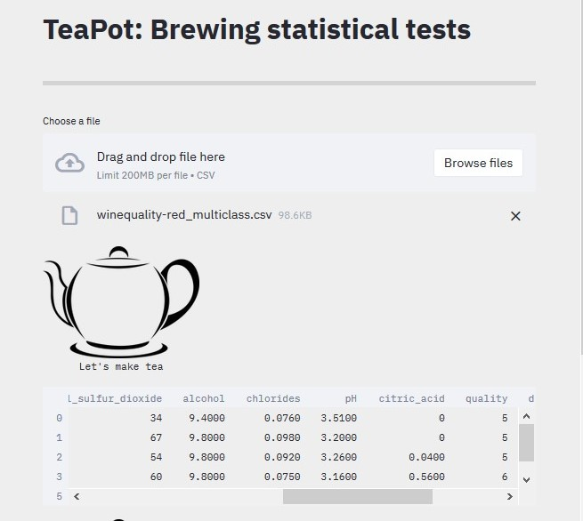
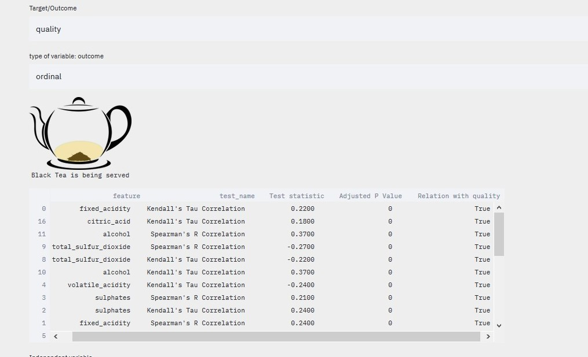
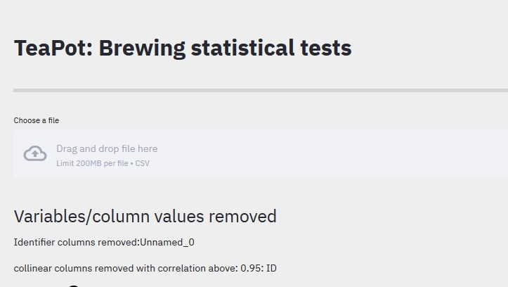
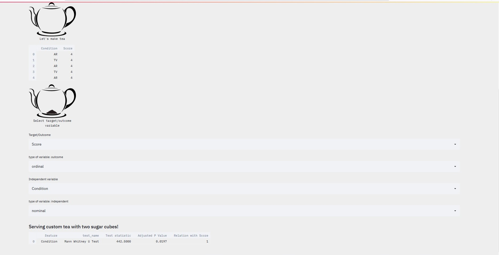

# teapot-ui
For beginners and non-programmers, getting statistical tests done could create headaches. What if we only want to know if there is a relationship between one of the independent variable and the outcome (and leave the pre-conditions and finding suitable tests by a program). \
The program does auto-detection of column types, removes identifier columns and stationary columns,  do a bit of cleanup and run the tests using TeaLang \

[Try it out without install](https://dossiers.page/teapot-simplifying-statistical-tests-with-a-click/)

## Installation and running the application 
* clone/download the repository 
* create a new environment in python (optional) 
* pip install -r requirements.txt 
* cd teapot 
* streamlit run main.py 

## Screenshots

